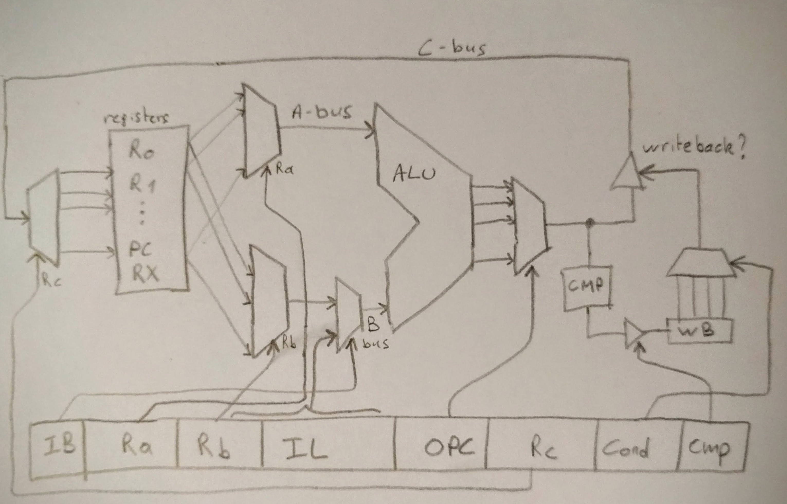

#coffee-cpu

After drinking too much coffee, we built a CPU.

##ISA

###registers
There are 16 32-bit registers: R0-13,PC and RX. 
PC (R14) is the program counter. Writing this register causes a jump in the code. 
Rx (R15) is an overflow register. It cannot be written directly but will hold a second result value like the remainder of a division or the highest 32 bits of a multiplication.

###instruction layout
Instructions are 32 bit wide and consist of these bits:

    IB  ( 1bit) select register B or immediate value
    RA  ( 4bit) register A
    RB  ( 4bit) register B, or 4 MSB's of immediate value when IB=1
    IL  (10bit) lowest bits of immediate value
    OP  ( 5bit) Opcode selector for ALU/Memory
    RC  ( 4bit) register C
    WC  ( 3bit) Writeback condition
    CMP ( 1bit) Compare result to zero

Sketch of the execute stage:


The first ALU input (A-bus) is selected by Ra (Register A). The second ALU input (B-bus) is selected by Rb (Register B), or can be a 14-bit immediate value (Rb|IL) when bit IB (Immediate B) is set. The immediate value is sign extended to 32-bits.

OP selects an ALU or memory operation:

    LOAD  (0x01): C <= mem[Ra+BBus]
    STORE (0x02): mem[B] = Ra, C <= Ra-1 (store with post-decrement)
    AND   (0x03): C <= Ra & B
    OR    (0x04): C <= Ra | Rb
    XOR   (0x05): C <= Ra ^ Rb
    ADD   (0x06): C <= Ra + Rb
    ADDC  (0x07): C <= Ra + Rb + carry_bit
    SUB   (0x08): C <= Ra - Rb
    MUL   (0x09): C <= (Ra*Rb)[31:0], Roverflow = (Ra*Rb)[63:32]
    DIV   (0x0A): C = Ra/Rb, Roverflow = Ra%Rb (unsigned)
    SDIV  (0x0B): C = Ra/Rb, Roverflow = Ra%Rb (signed)

Writeback of the ALU result (C-bus) to register Rc is conditional based on the WC (Writeback Condition) instruction bits and the result of the last compare (status register):

    NEVER  = 0 // don't write back
    ALWAYS = 1 // write Cbus back to RC
    ZERO   = 2 // write back if last compare was zero
    NZ     = 3 // write back if last compare was nonzero
    GE     = 4 // write back if last compare was >= 0
    LT     = 5 // write back if last compare was < 0

When the CMP (compare) instruction bit is set, the value on the C-bus is compared against 0 and the result is stored in the status register. The status register will then be used by the writeback condition of the following instructions.

###memory

There is a 14 bit memory space, addressing 12 bit instruction memory, 12 bit program memory and a memory-mapped peripheral:
0x3FFF : 16-bit register displayed on 7-segment LED display.

##CPU
Directory CPU/ has a verilog implementation of the CPU, which works on an FPGA (@mathiashelsen). The CPU currently clocks at 100MHz and issues 1 instruction per cycle (2 cycles for LOAD/STORE). 

##assembler
Command ``ass`` assembles source files into ihex executables, which can be loaded into the FPGA memory (@barnex):
Documentation: http://godoc.org/github.com/barnex/coffee-cpu/cmd/ass

##emulator
Command ``emu`` emulates ihex execution on a PC (@barnex). It features tracing execution (``-trace`` flag)
```
emu -trace test.ihex
```


##example program
```
// This test program cycles the hex display
// through all 16-bit values

#def display 0x3FFF
#def Rcount R1

#label _start
XOR   R0     R0       A R0     -cmp
STORE Rcount display  N R0     -cmp
ADD   Rcount 1        A Rcount -cmp
ADD   R0     _start   A PC     -cmp
```

output of ``emu -trace``:
```
  XOR   R0(0)   R0(0) A(true)     R0(0) 
STORE   R1(0)   16383 N(false)     R0(0) 
  ADD   R1(0)       1 A(true)     R1(1) 
  ADD   R0(0)       0 A(true)    R14(0) 
  XOR   R0(0)   R0(0) A(true)     R0(0) 
STORE   R1(1)   16383 N(false)     R0(0) 
  ADD   R1(1)       1 A(true)     R1(2) 
  ADD   R0(0)       0 A(true)    R14(0) 
  XOR   R0(0)   R0(0) A(true)     R0(0) 
STORE   R1(2)   16383 N(false)     R0(0) 
  ADD   R1(2)       1 A(true)     R1(3) 
  ADD   R0(0)       0 A(true)    R14(0) 
  XOR   R0(0)   R0(0) A(true)     R0(0) 
...
```

Watch this program running on FPGA: https://youtu.be/CDd83oF9Tog (downclocked to 1Hz for clarity).
